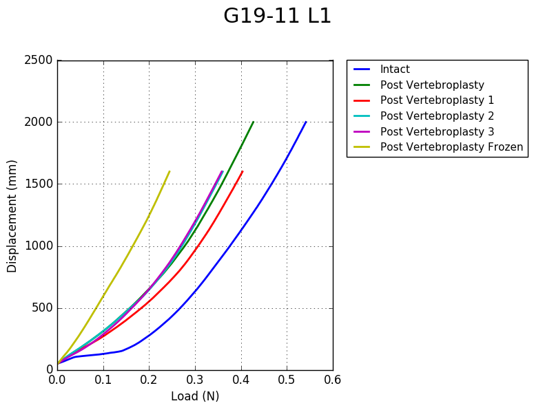

# findStiffness
Finds and plots the stiffness of specimens from load displacement csv data.

##findStiffness.py

Reports the maximum stiffness for all csv files in directories in a given directory (third argument).
    
    findStiffness(segmentSize,incrementSize,plot,initialDirectory)
    
    int segmentSize #the size in data points of each segment to sample
    int incrementSize #the size in datapoints to increment
    bool plot #whether the plotStiffness.py is being used
    string initialDirectory #the dir containing other dirs that contain csv's named 'Specimen_RawData_1.csv'

##findStiffness_iter.py

Iterates through segsize of 0 - 100, to investigate effect of segment size. Calls findStiffness.py

##plotStiffness.py

Plots the load displacement data in groups of the same specimen - hence shows the results of the different tests.
Takes an argument of the number of species and assumes the same number of tests for all specimens.
Second argument takes the file format for the outputed plots (pdf,png).

Also assumes naming in the form of: `'G19-11_L1 type of test .is_comp_RawData'`.

Plots data as shown here: 

